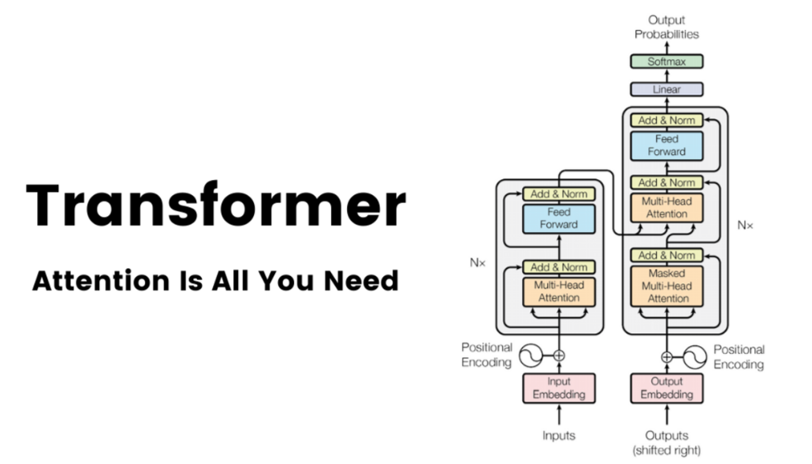

# Attention Is All You Need

정리 날짜: 2026년 1월 17일
저자: Ashish Vaswani et al. (Google Brain, Google Research)
카테고리: NLP

---

## 🧐 AI 개발자라면 꼭 읽어야 한다는 Attention Is All You Need 논문

- 원문 그대로 읽다, 한글로 번역해 읽으며 정리했습니다. 저는 용어에 뜻을 모르면 글을 읽기가 힘들다 생각해, 이해가 안가는 용어들은 뜻 정리해 가며 읽었습니다.
- 큰 제목은 논문 흐름에 맞게 정리했습니다!

# 1. Abstract

### **1. 순환(Recurrence)과 합성곱(Convolution)의 탈피**

기존 시퀀스 변환 모델의 지배적인 구조였던 복잡한 **순환 신경망(RNN)**이나 **합성곱 신경망(CNN)**을 완전히 배제했습니다. 대신, 오직 **어텐션 메커니즘(Attention Mechanisms)** 에만 전적으로 의존하는 단순하고 새로운 네트워크 아키텍처인 **Transformer**를 제안했습니다.

### **2. 병렬화(Parallelization)와 효율성 극대화**

순차적으로 계산해야 했던 순환(Recurrence) 구조를 제거함으로써, **데이터의 전체적인 병렬 처리(Parallelization)**가 가능해졌습니다. 이는 기존 모델 대비 학습에 소요되는 시간을 획기적으로 단축시키는 결과를 가져왔습니다.

### **3. 압도적인 성능(SOTA)과 일반화 능력**

WMT 2014 영어-독일어 번역 태스크에서 **28.4 BLEU**를 기록하며, 기존의 앙상블 모델을 포함한 최고 기록을 **2 BLEU 이상** 큰 폭으로 갱신했습니다. 또한 번역뿐만 아니라 구문 분석(Constituency Parsing) 등 훈련 데이터가 많거나 적은 다양한 태스크에서도 뛰어난 **일반화 성능**을 입증했습니다.

<aside>
✏️

**용어 정리**

- **Sequence Transduction (시퀀스 변환)**
  ⇒ 입력된 시퀀스(문장, 음성 등)를 다른 형태의 출력 시퀀스로 변환하는 작업. (예: 기계 번역 `Hello` → `안녕`, 텍스트 요약, 음성 인식 등)
- **Attention Mechanisms (어텐션 메커니즘)**
  ⇒ 출력 단어를 예측할 때, 입력된 문장 전체 중에서 **어떤 단어에 집중(Attention)해야 하는지**를 수치적으로 판단하는 기법. 마치 사람이 글을 읽을 때 문맥에 따라 중요한 단어에 눈길을 더 주는 것과 같은 원리입니다.
- **BLEU (Bilingual Evaluation Understudy)**
⇒ 기계 번역의 품질을 평가하는 가장 대표적인 점수. 기계가 번역한 문장이 **사람이 번역한 정답 문장과 얼마나 유사한지**를 비교하여 산출. 점수가 높을수록 사람의 번역과 비슷하다는 뜻입니다.
</aside>

---

# 2. Introduction: Why Transformer?

<aside>
💡

**왜 순환(Recurrence) 구조를 버려야 했는가?**
RNN, LSTM, GRU와 같은 순환 신경망 모델들은 시퀀스 모델링 분야의 SOTA(State of The Art)로 자리 잡고 있었으나, 구조적으로 해결하기 힘든 **근본적인 한계**가 존재했습니다.

</aside>

## 1. 순차적 계산의 제약 (Sequential Nature)

> 순환 모델은 본질적으로 입출력의 위치(Position)에 따라 순차적으로 계산을 진행해야 합니다.

- **작동 방식**

  $t$시점의 은닉 상태(hidden state) $h_t$를 계산하려면, 반드시 이전 시점의 상태 $h_{t-1}$이 계산될 때까지 기다려야 합니다.

- **문제점**
  이러한 의존성 때문에 **병렬 처리(Parallelization)가 불가능**합니다. 시퀀스의 길이(문장의 길이)가 길어질수록 계산 시간은 늘어나고, GPU와 같은 하드웨어의 병렬 연산 성능을 온전히 활용할 수 없습니다.

## **2. 장거리 의존성 학습의 어려움 (Long-range Dependencies)**

> 문장의 의미를 정확히 파악하려면, 서로 멀리 떨어진 단어들 사이의 관계(예: 문장 맨 앞의 주어와 맨 뒤의 동사)를 학습해야 합니다.

- **문제점**
  순환 모델에서는 두 단어 사이의 거리가 멀수록 정보가 여러 단계를 거쳐 전달되어야 하므로, 정보 손실이 발생하거나 그 관계를 학습하기가 매우 어려워집니다.

## **🚀 Transformer의 해결책**

> Transformer는 **순환(Recurrence)을 완전히 배제**하고, 대신 **어텐션(Attention)** 메커니즘만을 사용하여 이 문제를 해결했습니다.

- 입력과 출력 사이의 **전역적 의존성(Global Dependencies)**을 한 번에 계산합니다.

- 단어 간의 거리와 상관없이 **상수(Constant) 시간** 내에 모든 정보에 접근할 수 있어 병렬 처리가 가능하고 학습 속도가 비약적으로 향상됩니다.

<aside>
✏️

**용어 정리**

- **Hidden State (은닉 상태)**
  ⇒ 네트워크가 과거의 데이터를 기억하고 있는 '메모리' 상태입니다. RNN에서는 이전 단계의 기억($h_{t-1}$)을 현재 단계($t$)로 넘겨주며 문맥을 이어갑니다.
- **Global Dependencies (전역적 의존성)**
⇒ 문장 내의 특정 단어가 바로 옆에 있는 단어뿐만 아니라, 문장 전체(Global)의 다른 모든 단어들과 맺고 있는 관계를 의미합니다. Transformer는 이를 한 번에 파악합니다.
</aside>

---

# 3. Model Architecture (핵심 이론 분석)

## **1. Encoder & Decoder Structure**

> Transformer는 인코더(Encoder)와 디코더(Decoder) 구조를 따르며, 각각 **N=6개**의 동일한 레이어를 쌓아 올린(Stack) 형태입니다.

- **Encoder**

  각 레이어는 **Multi-Head Self-Attention**과 **Position-wise Feed-Forward Network**라는 두 개의 서브 레이어로 구성됩니다.

- **Decoder:** 인코더와 유사하지만, 차이점이 있습니다.
  1. 인코더의 출력을 받아 처리하는 어텐션 레이어가 중간에 하나 더 추가됩니다.
  2. **Masking:** 자기 자신을 참조하는 Self-Attention 시, 현재 위치보다 **미래에 있는 단어(정답)를 미리 보지 못하도록** 마스킹 처리를 합니다.

## 2. Scaled Dot-Product Attention (Self-Attention의 핵심)

> 어텐션은 **쿼리(Query), 키(Key), 값(Value)** 벡터를 이용해 입력 단어들 간의 연관성을 계산하는 과정입니다.

- 핵심 수식

$$
Attention(Q, K, V) = \text{softmax}\left(\frac{QK^T}{\sqrt{d_k}}\right)V
$$

- 동작 원리
  1. **$QK^T$(내적):** 쿼리와 키의 유사도를 구합니다.
  2. **$\sqrt{d_k}$(스케일링):** 차원($d_k$)이 커지면 내적 값이 너무 커져 Softmax의 기울기가 소실되는(vanishing gradient) 문제가 발생합니다. 이를 나누어주어 학습을 안정화합니다.
  3. **Softmax:** 확률값(가중치)으로 변환합니다.
  4. **$V$(값):** 최종적으로 중요한 정보(Value)만 가중합하여 가져옵니다.

## **3. Multi-Head Attention**

> **"왜 어텐션을 한 번만 하지 않고 여러 개로 쪼개서 하는가?"**

단일 어텐션만 사용하면 문장의 여러 측면을 동시에 포착하기 어렵습니다. (평균화 문제) 논문에서는 8개의 헤드(Head)로 나누어 병렬 처리를 수행합니다. 이를 통해 모델은 **"누가(Who)", "언제(When)", "무엇을(What)"** 등 서로 다른 관점의 정보를 동시에 학습할 수 있게 됩니다.

## **4. Positional Encoding**

> **"RNN도 없고 CNN도 없는데 순서는 어떻게 아는가?"**

Transformer는 데이터를 병렬로 처리하므로 단어의 **위치 정보**가 없습니다. 이를 해결하기 위해 입력값에 위치 정보를 더해줍니다.

- **방식**

  사인(Sine)과 코사인(Cosine) 함수를 이용해 고유한 패턴을 만들어 더해줍니다.

- **장점**
  - 주기적인 함수 특성 덕분에 모델이 **상대적인 위치(Relative Position)**를 쉽게 학습합니다.
  - 학습 때 보지 못한 더 긴 문장이 들어와도 위치를 유추(Extrapolate)할 수 있습니다.

## **5. Position-wise Feed-Forward Networks (FFN)**

> 각 어텐션 레이어 뒤에 붙는 일반적인 신경망입니다.

$$
FFN(x) = \text{ReLU}(xW_1 + b_1)W_2 + b_2
$$

⇒ 단순하게 설명하면: **선형 변환 → ReLU(비선형성) → 선형 변환** 과정을 거칩니다. 이는 각 단어 위치마다 **개별적이고 동일하게** 적용됩니다.

## 6. Residual Connection & Layer Normalization

> 깊은 신경망 학습을 가능하게 하는 필수 테크닉입니다. 각 서브 레이어를 거친 후 다음 공식이 적용됩니다.

$$
Output = \text{LayerNorm}(x + \text{Sublayer}(x))
$$

- **$x + \text{Sublayer}(x)$:** 잔차 연결. 원본 정보 $x$ 를 더해주어 정보 손실을 막고 학습을 돕습니다.

<aside>
✏️

**용어 정리**

- **Query, Key, Value (Q, K, V)**
  ⇒ 검색 시스템(Search Engine)에 비유하면 이해가 쉽습니다. - **Query (질의):** 내가 찾고자 하는 질문 ("이 단어와 연관된 게 뭐야?") - **Key (키):** 검색 대상들의 색인표 ("나 여기 있어!") - **Value (값):** 실제 내용물 ("여기 그 정보가 있어.")
  ⇒ 즉, **Query와 Key가 얼마나 비슷한지 확인**한 후, 그 유사도만큼 **Value를 가져오는 것**입니다.
- **Masking (마스킹)**
  ⇒ 디코더 학습 시, 아직 예측하지 않은 **미래의 단어를 가리는 기법**입니다. "I am a student"를 학습할 때 "am"을 예측하는 시점에서 "a student"를 미리 보면 컨닝이 되므로, 이를 보지 못하게 0으로 처리하는 것입니다.
- **Layer Normalization (레이어 정규화)**
⇒ 데이터의 값들이 너무 튀지 않게 평균 0, 분산 1에 가깝게 맞춰주는 과정입니다. 학습 속도를 높이고 안정적으로 만듭니다.
</aside>

---

# 4. Why Self-Attention? (vs RNN/CNN)

<aside>
💡

**구조적 차이점 및 장점 분석**
이 논문에서 순환(Recurrence)이나 합성곱(Convolution) 대신 Self-Attention을 선택한 이유는 크게 세 가지입니다.

1. **장거리 의존성 학습** (경로가 짧을수록 좋음)
2. **병렬화 가능성** (순차 연산이 적을수록 좋음)
3. **레이어당 계산 복잡도** (낮을수록 좋음)
</aside>

## 1. 레이어당 계산 복잡도 (Complexity per Layer)

- **RNN:** $O(n \cdot d^2)$

- **Self-Attention:** $O(n^2 \cdot d)$

- **분석:** 보통 NLP 태스크에서는 문장의 길이($n$)가 표현 차원($d$)보다 작은 경우가 많습니다. ($n < d$ ). 이 경우 Self-Attention이 RNN보다 **연산량이 더 적어** 빠릅니다. (반대로 문장이 매우 길어지면 Attention이 불리해질 수 있어, 논문에서는 제한된 범위만 보는 기법을 언급하기도 합니다.)

## 2. 병렬화 (Parallelization)

- **RNN:** 이전 단계의 계산이 끝나야 다음 단계를 계산할 수 있어 순차적 연산(Sequential Operations)이 필수적입니다. ($O(n)$)

- **Transformer:** 문장 내의 모든 위치에서 동시에 어텐션을 계산할 수 있습니다. 순차적으로 기다려야 하는 단계가 최소화되어($O(1)$) GPU 가속을 극대화할 수 있습니다.

## **3. 장거리 의존성 (Long-Range Dependencies)**

> 정보가 전달되는 최대 경로 길이(Maximum Path Length)는 학습 능력에 결정적인 영향을 미칩니다.

- **RNN:** 문장 맨 앞의 정보가 맨 뒤로 전달되려면 $n$번의 단계를 거쳐야 합니다. ($O(n)$). 거리가 멀수록 정보가 희석되거나 **그래디언트 소실(Gradient Vanishing)** 문제가 발생하기 쉽습니다.

- **Transformer:** 모든 단어가 서로 1:1로 직접 연결됩니다. 물리적 거리에 상관없이 정보 접근 경로가 단 한 번의 단계($O(1)$)로 끝납니다. 이는 긴 문맥을 파악하는 데 훨씬 유리합니다.

## 4. 해석 가능성 (Interpretability)

> 성능 외적인 장점으로, 모델의 동작 원리를 눈으로 확인할 수 있습니다.

- **Self-Attention 시각화:** 모델이 번역이나 문장 생성 시 **어떤 단어에 집중하고 있는지** 히트맵(Heatmap) 형태로 시각화가 가능합니다.

- 실험 결과, 각 헤드(Head)가 문법적 구조나 의미적 관계 등 서로 다른 역할을 분담하여 학습한다는 것이 확인되었습니다.

<aside>
✏️

**용어 정리**

- **Gradient Vanishing (기울기 소실)**
⇒ 딥러닝 모델 학습 시, 역전파(Backpropagation) 과정에서 오차 정보가 입력층으로 갈수록 점점 작아져서 결국 **0에 수렴해버리는 현상**입니다. 이렇게 되면 모델 앞단은 학습이 전혀 되지 않아 성능이 떨어지는데, RNN이 긴 문장에서 겪는 대표적인 고질병입니다.
</aside>

---

# 5. Conclusion (실험 결과 및 결론)

## **1. Machine Translation Results (압도적인 효율성)**

> Transformer는 단순히 성능만 좋은 것이 아니라, 학습 효율성 면에서도 혁신적이었습니다.

- **WMT 2014 English-to-German:** Transformer (Big) 모델이 **28.4 BLEU**를 기록하며 SOTA를 달성했습니다.
  - **효율성:** 기존 최고 모델들이 며칠, 몇 주가 걸리던 학습을 **3.5일(8 P100 GPU)** 만에 끝냈습니다. 계산 비용(FLOPs) 측면에서 기존 대비 **1/4 이하의 리소스**만 사용했습니다.

- **WMT 2014 English-to-French:** **41.0 BLEU**를 기록하며, 다른 경쟁 모델들이 여러 모델을 합친 앙상블(Ensemble) 기법을 써야 했던 점수를 **단일 모델**로 넘어섰습니다.

## 2. Generalization (범용성 입증)

> 번역 외의 다른 태스크에서도 잘 작동하는지 확인하기 위해 **영어 구문 분석(Constituency Parsing)** 실험을 진행했습니다.

- **결과**: 이 태스크에 특화된 튜닝을 거의 하지 않았음에도 불구하고 매우 높은 성능을 보였습니다. 이는 Transformer가 특정 언어 쌍 번역에만 국한되지 않고, 시퀀스 데이터의 구조를 파악하는 능력이 탁월함을 입증합니다.

<aside>
✏️

**용어 정리**

- **FLOPs (Floating Point Operations)**
  ⇒ 컴퓨터가 수행하는 부동 소수점 연산의 횟수입니다. 딥러닝에서는 **'모델을 학습시키는 데 얼마나 많은 계산(돈과 시간)이 들어갔는가?'**를 나타내는 척도로 쓰입니다. Transformer는 적은 FLOPs로 더 높은 성능을 냈다는 점에서 '가성비'가 압도적이었습니다.
- **Constituency Parsing (구문 분석)**
⇒ 문장을 문법적 구조(주어, 동사, 목적어 등)에 따라 트리 형태로 분석하는 작업입니다. 번역이 단순히 단어를 바꾸는 것이라면, 구문 분석은 문장의 뼈대를 발라내는 작업인데, Transformer가 구조적 이해력도 뛰어나다는 것을 보여줍니다.
</aside>

---

### 📝 논문을 읽고 한 줄 요약!

복잡한 순환(Recurrence) 구조 없이도, **"Attention"** 만으로 전역적인 문맥을 파악하여 **더 빠르고(병렬화)**, **더 정확하게(장거리 의존성 해결)** 시퀀스를 처리할 수 있음을 증명한 논문!!
